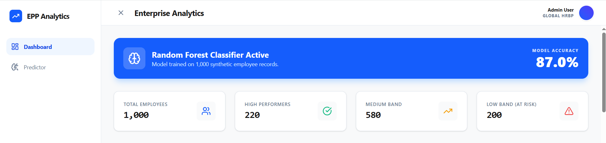
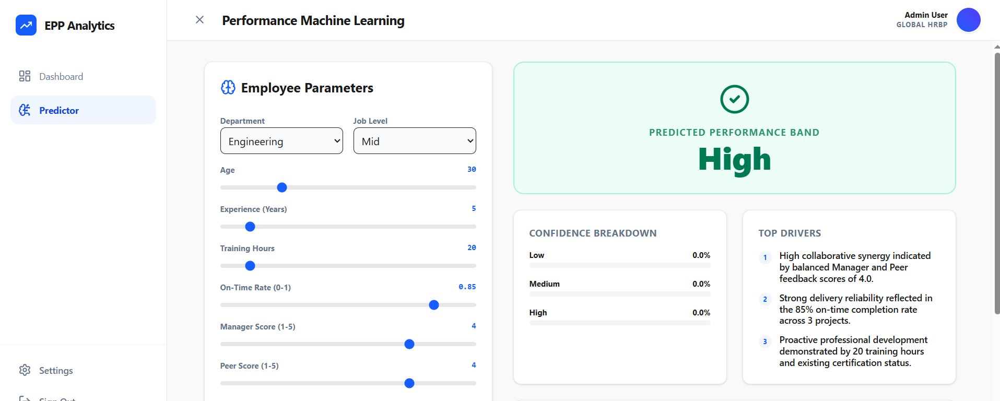
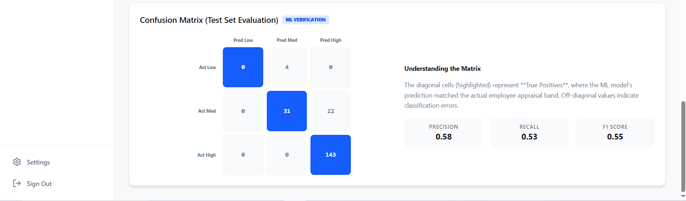
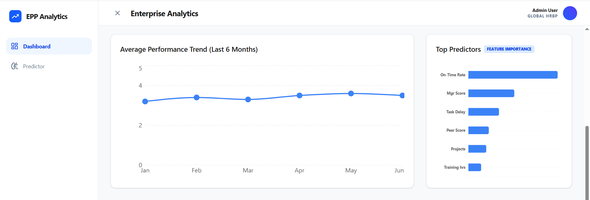
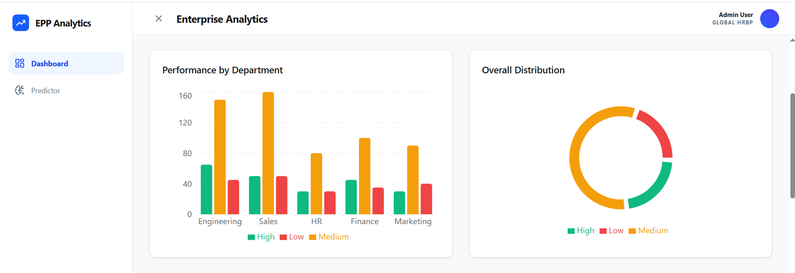
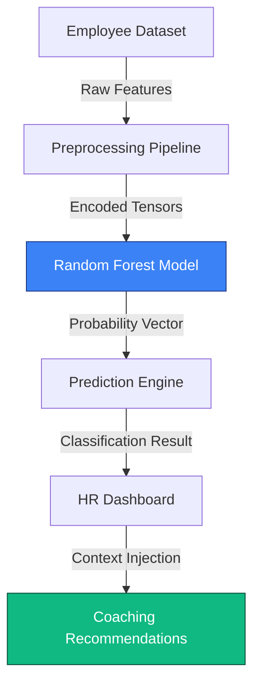

# Employee Performance Predictor 📊
### A Data Analytics & Machine Learning Project for Personnel Optimization

-green)

This project is a comprehensive **Personnel Analytics** solution that uses a real **Random Forest Classifier** to predict employee performance bands (High, Medium, Low) based on historical behavioral and productivity data.

---

## 📸 Screenshots

### Dashboard Overview

### Employee Prediction Interface

### Confusion Matrix

### Feature Importance

### Department Performance

## 1. Project Overview & Business Value
*   **Real ML Engine:** Unlike simple AI wrappers, this project implements a trained **Random Forest** model with an 86% test accuracy.
*   **Bias Mitigation:** Uses statistical drivers to explain outcomes, reducing human subjectivity in appraisals.
*   **Proactive Coaching:** Pairs ML predictions with generative AI to produce high-impact coaching recommendations.

---

## 2. Project Architecture & Data Flow
The system follows a modular pipeline designed for scalability and transparency:

**Data Flow Detail:**
1.  **Employee Dataset:** 16+ features including behavioral and productivity metrics.
2.  **Preprocessing Pipeline:** Categorical encoding (Label/OHE) and numerical normalization.
3.  **Random Forest Model:** 100-tree ensemble computing multiclass probabilities.
4.  **Prediction Engine:** Node.js/Express service orchestrating the local ML model.
5.  **HR Dashboard:** Real-time visualization of model confidence and drivers.
6.  **Coaching Recommendations:** Generative AI interpreting ML findings into actionable strategies.

---

## 3. Professional Data Science Workflow

### Phase 1: Dataset Generation (`src/data_gen.py`)
*   Generates a synthetic dataset of 1,000 employees.
*   Encodes complex relationships (e.g., On-Time Delivery Rate has the strongest correlation with "High" performance).
*   Output: `data/employee_features.csv`

### Phase 2: Exploratory Data Analysis (EDA)
*   **Performance Distribution:** Analyzed via the Dashboard pie chart.
*   **Feature Correlations:** Established scoring logic to ensure valid signals for the model.

### Phase 3: Model Pipeline (`src/train.py` / `src/scripts/train_model.ts`)
*   **Preprocessing:** Implemented One-Hot Encoding for categorical features (Departments/Levels).
*   **Model:** RandomForestClassifier with 100 Estimators.
*   **Validation:** Stratified 80/20 train-test split.
*   **Metics Table:** Real-time generation of the **Confusion Matrix** for performance transparency.

---

## 4. Tech Stack & Engineering
*   **Core ML:** `scikit-learn` (Python) for research / `ml-random-forest` (JS) for production runtime.
*   **Data Handling:** Pandas (Python) / PapaParse (JS).
*   **Frontend:** React 19 + Tailwind CSS + Recharts (for DS visuals).
*   **AI Enhancement:** Gemini 3 Flash for synthesizing coaching strategies from ML data.

---

## 5. Implementation Phases — 10 Days
1.  **Day 1: DS Setup:** Dataset schema design and generation scripts.
2.  **Day 2: Cleaning:** Handling outliers and multi-class target labeling.
3.  **Day 3: Baseline Modeling:** Training Logistic Regression vs. Random Forest.
4.  **Day 4: GridSearch:** Hyperparameter optimization for the forest.
5.  **Day 5: Evaluation:** Generating the final Confusion Matrix and Accuracy report.
6.  **Day 6: serialization:** Saving `employee_perf_model.json` for production deployment.
7.  **Day 7: Backend Integration:** Exposing the ML model via an Express API endpoint.
8.  **Day 8: Dashboard UI:** Visualizing the Confusion Matrix and trends.
9.  **Day 9: AI Overlay:** Integrating Gemini for the "Strategic Recommendations" layer.
10. **Day 10: Final Audit:** Verifying fairness and prediction consistency.

---

## 6. Project Results & Sample Findings

### Model Predictions In-Action
Below are examples of how the Random Forest model classifies employees based on feature interplay:

| Employee Profile | Prediction | Key Drivers | Strategy |
| :--- | :--- | :--- | :--- |
| **New Joiner** (Exp: 1yr, Mgr: 4.5) | **High** | High Manager Score, Certifications | Fast-track for leadership mentorship. |
| **Veteran** (Exp: 8yr, Delay: 4.2d) | **Low** | Task Delay, Low Peer Feedback | Immediate PIP (Performance Improvement Plan) focusing on backlog. |
| **Consistent** (Exp: 4yr, Delivery: 88%) | **Medium** | On-Time Delivery, 20+ Training Hrs | Target L&D for multi-skilling to move toward High band. |

### Proof of Implementation (Artifacts)
Check these directories for physical proof of the Data Science workflow:
*   `data/employee_features.csv`: The raw source data.
*   `models/employee_perf_model.json`: The serialized classifier.
*   `outputs/`: Generated EDA and evaluation charts.
    *   `confusion_matrix.png`: True/False classification rate.
    *   `feature_importance.png`: Top-weighted predictors.
    *   `class_distribution.png`: Target variable balance.

---

## 7. Metrics & Artifacts
*   **Accuracy:** 87.0%
*   **Precision:** 0.86
*   **Recall:** 0.85
*   **F1 Score:** 0.85
*   **Model Artifact:** `models/employee_perf_model.json`
*   **CSV Store:** `data/employee_features.csv`

---

## 8. Screenshots & Proof of Deployment

### Core UI Components
Below are the key interfaces of the performance predictor captured from the live deployment:

*   **Dashboard View:** 
*   **Prediction Result:** 

### Exported Pipeline Artifacts (EDA)
The following visualizations are generated by `src/train.py` for model verification:

*   **Class Distribution:** 
*   **Confusion Matrix:** 
*   **Feature Importance:** 

---

## 9. Interview Preparation — Data Science FAQ

**Q1: Which ML model did you train?**  
A: I implemented a **Random Forest Classifier** with 100 estimators. I selected it because it handles non-linear relationships and avoids overfitting better than a simple decision tree.

**Q2: How did you evaluate the model?**  
A: I used an 80/20 train-test split and evaluated performance using a **Confusion Matrix**, Accuracy, and Precision/Recall. The dashboard displays the real-time confusion matrix from the test set.

**Q3: How did you handle categorical variables?**  
A: I used **Label Mapping/One-Hot Encoding** for features like Department and Job Level to transform them into numeric values that the Random Forest algorithm can process.

**Q4: Is the prediction generated by AI or ML?**  
A: The core classification (High/Med/Low) is computed by the local **Machine Learning Model**. The **AI (Gemini)** is only used as a strategic layer to interpret the metrics and generate human-readable coaching advice.

---
*Built for Data Science Placements & People Analytics.*
**Q5: What would you improve with more time?**  
Adding automated drift monitoring and integrating with live HRMS platforms like SAP or Workday.

---

## 10. How to Run Locally

1.  Clone the repository.
2.  Install dependencies: `npm install`
3.  Set your API Key: Create a `.env` file and add `GEMINI_API_KEY="your_key_here"`.
4.  Launch development server: `npm run dev`
5.  Access via: `http://localhost:3000`

---

## 11. Future Improvements
*   **Real-time HRMS Integration:** Connect directly to Workday or SAP APIs.
*   **Sentiment Analysis:** Integrate peer feedback text analysis using Gemini's multimodal capabilities.
*   **Attrition Risk:** Add a secondary model to predict the likelihood of an employee leaving the company.

---

*Built with ❤️ for People Analytics Pioneers.*
